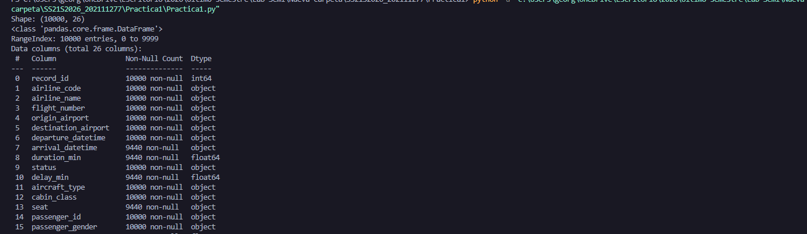
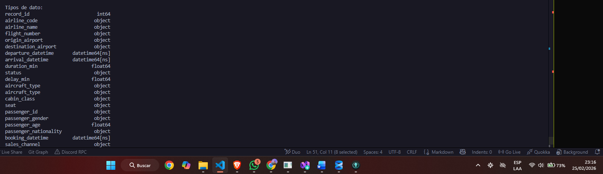
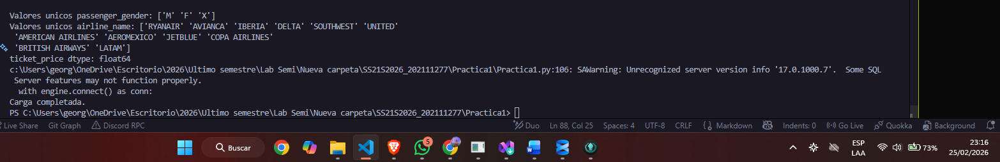
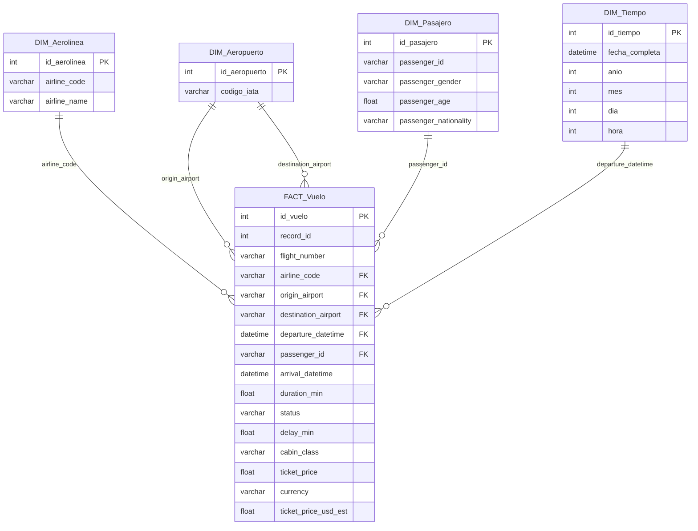
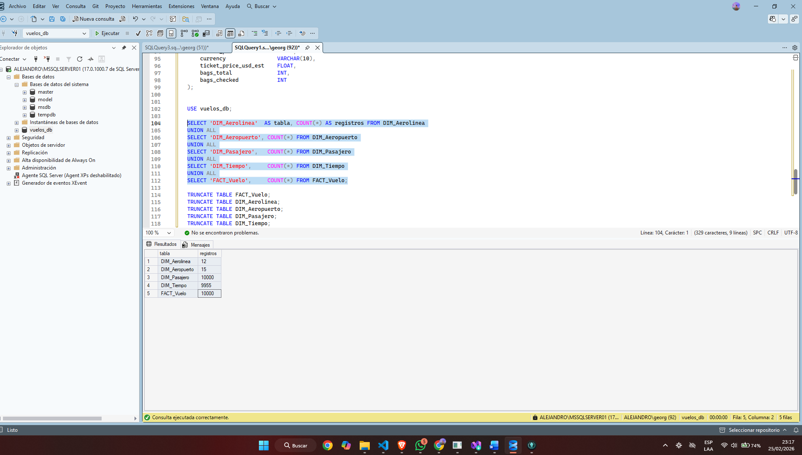
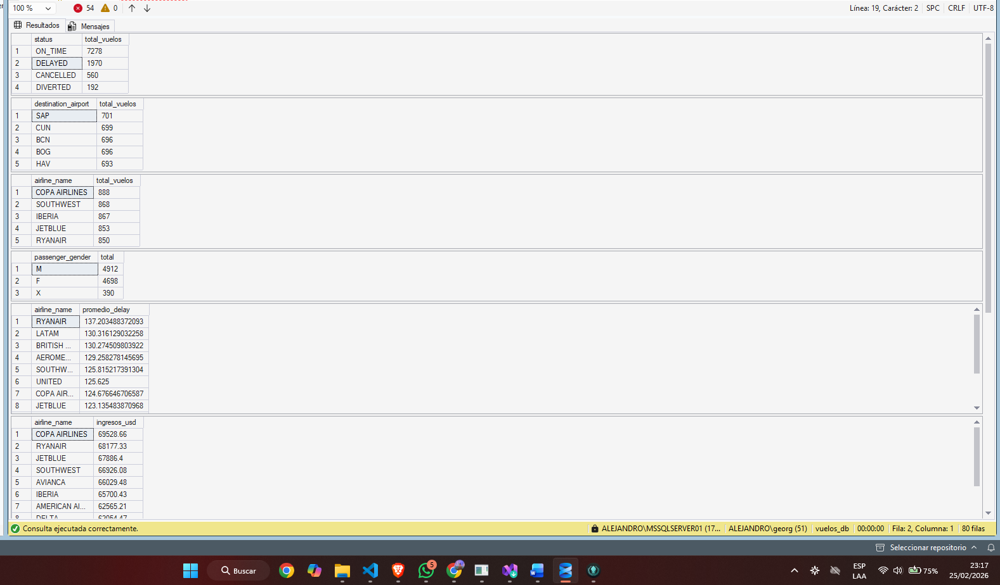

# Práctica 1 — ETL con Python: de dataset crudo a tabla relacional lista para análisis

**Curso:** Seminario de Sistemas 2  
**Universidad:** Universidad San Carlos de Guatemala — Facultad de Ingeniería  
**Estudiante:** Jorge Alejandro De León Batres  
**Carnet:** 202111277  
**Repositorio:** SS22S2026_202111277  

---

## Descripción

Implementación de un proceso ETL completo en Python que extrae datos crudos de registros de vuelos, los transforma y estandariza, y los carga en un modelo multidimensional en SQL Server listo para consultas analíticas.

---

## Estructura del repositorio

```
SS22S2026_202111277/
└── Practica1/
    ├── Practica1.py              # Script ETL completo (extracción, transformación, carga)
    ├── crear_modelo.sql          # Script SQL para crear las tablas en SQL Server
    ├── consultas_analiticas.sql  # Consultas SQL para validación y análisis
    ├── dataset_vuelos_crudo.csv  # Dataset fuente
    └── README.md
```

---

## Requisitos

- Python 3.10+
- Microsoft SQL Server 2025
- ODBC Driver 17 for SQL Server

Instalar dependencias:

```bash
pip install pandas sqlalchemy pyodbc
```

---

## Proceso ETL

### Fase 1 — Extracción

Se carga el dataset desde el archivo CSV `dataset_vuelos_crudo.csv` usando pandas. El dataset contiene 10,000 registros y 26 columnas con información de vuelos, pasajeros y transacciones.



### Fase 2 — Transformación

Se identificaron y corrigieron los siguientes problemas de calidad de datos:

**Fechas con formatos mixtos**  
Las columnas `departure_datetime`, `arrival_datetime` y `booking_datetime` contenían dos formatos distintos mezclados:
- Formato A: `DD/MM/YYYY HH:MM` (ej: `20/01/2024 10:14`)
- Formato B: `MM-DD-YYYY HH:MM AM/PM` (ej: `03-15-2025 01:58 PM`)

Se implementó una función `parsear_fecha()` que intenta el formato A primero y donde queda `NaT` aplica el formato B.

**ticket_price con coma decimal**  
Algunos valores usaban coma como separador decimal (`77,60`). Se reemplazó la coma por punto y se convirtió a `float64`.

**Inconsistencias de texto**  
- `airline_name`: nombres duplicados por mayúsculas (`Ryanair` vs `RYANAIR`). Se estandarizó a mayúsculas.
- `origin_airport` y `destination_airport`: códigos IATA en minúscula (`jfk`, `bog`). Se estandarizó a mayúsculas.

**passenger_gender con 12 variantes**  
Se mapearon a 3 valores estándar:

| Variantes originales | Valor estándar |
|---|---|
| M, m, Masculino, masculino | M |
| F, f, Femenino, femenino | F |
| X, x, NoBinario, nobinario | X |

**Nulos**

| Columna | Nulos | Tratamiento |
|---|---|---|
| arrival_datetime, duration_min, delay_min, seat | 560 | Se conservan — corresponden a vuelos CANCELADOS |
| passenger_age | 112 | Relleno con la mediana |
| passenger_nationality | 209 | Relleno con 'DESCONOCIDO' |
| sales_channel | 144 | Relleno con 'DESCONOCIDO' |

### Fase 3 — Carga

Se cargaron los datos transformados en SQL Server usando SQLAlchemy + pyodbc en las siguientes tablas:

| Tabla | Registros |
|---|---|
| DIM_Aerolinea | 12 |
| DIM_Aeropuerto | 15 |
| DIM_Pasajero | 10,000 |
| DIM_Tiempo | 9,955 |
| FACT_Vuelo | 10,000 |

---

## Modelo Multidimensional



---

## Pasos de ejecución

1. Crear la base de datos en SQL Server:
```sql
CREATE DATABASE vuelos_db;
```

2. Ejecutar `crear_modelo.sql` en SSMS para crear las tablas.

3. Configurar la conexión en `Practica1.py`:
```python
SERVER   = 'TU_SERVIDOR\\MSSQLSERVER01'
DATABASE = 'vuelos_db'
```

4. Ejecutar el ETL:
```bash
python Practica1.py
```

5. Verificar la carga ejecutando `consultas_analiticas.sql` en SSMS.

---

## Consultas analíticas implementadas

1. Total de vuelos por estado (ON_TIME, CANCELLED, DELAYED, DIVERTED)
2. Top 5 destinos más frecuentes
3. Top 5 aerolíneas con más vuelos
4. Distribución de pasajeros por género
5. Promedio de delay por aerolínea

6. Ingresos totales por aerolínea en USD
7. Vuelos por mes y año
8. Canal de venta más usado
9. Clase de cabina más vendida
10. Top 5 rutas más frecuentes

