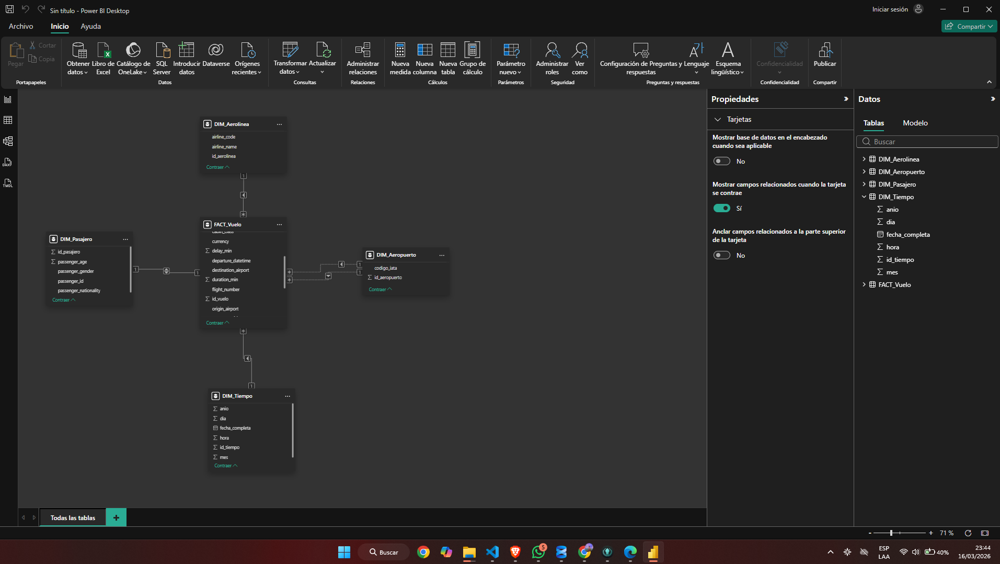
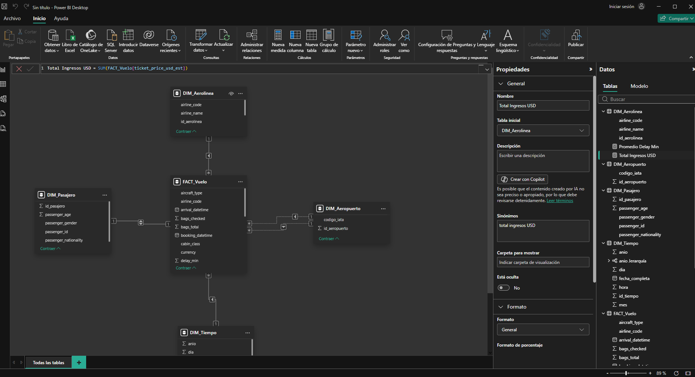
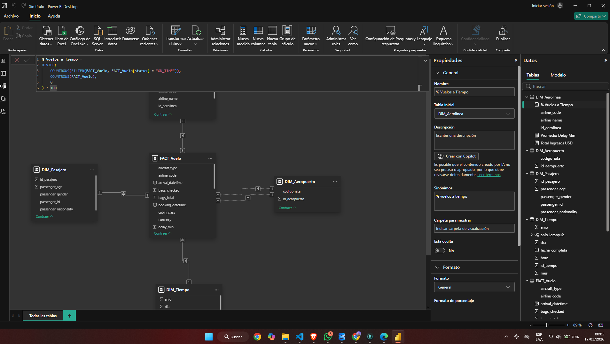
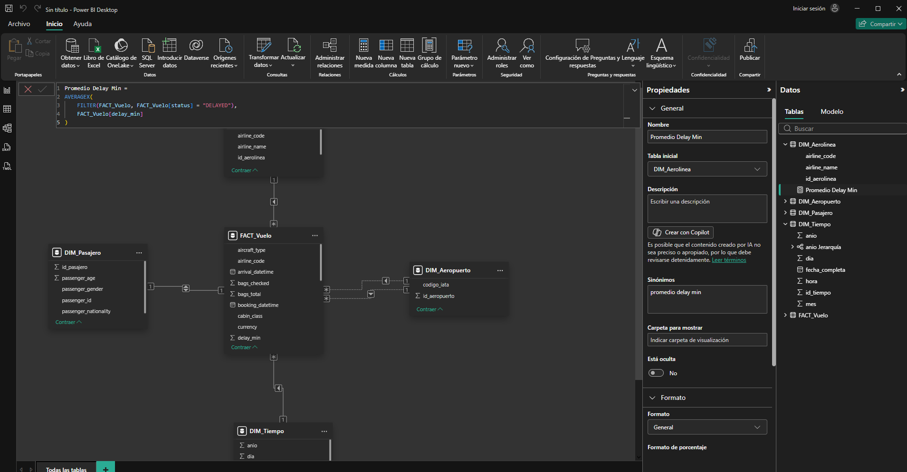
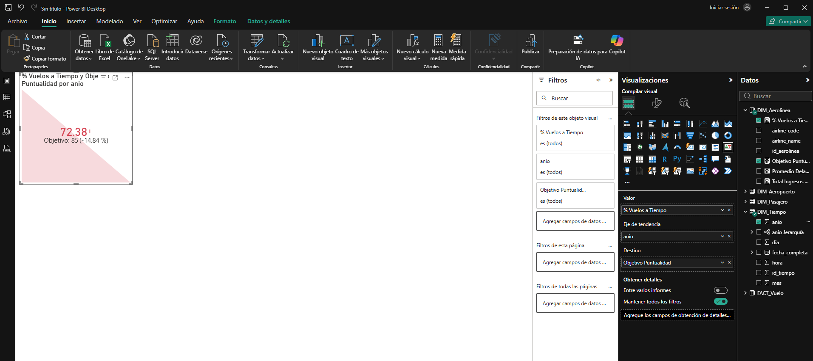
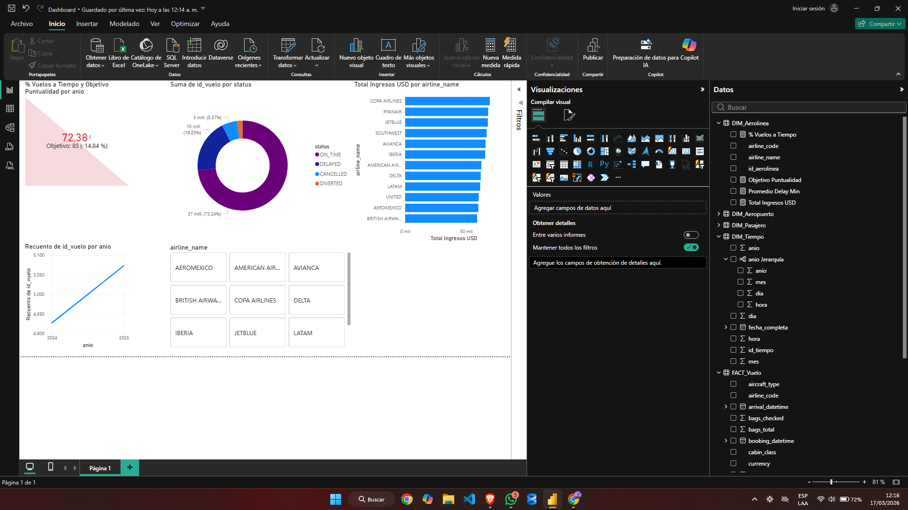
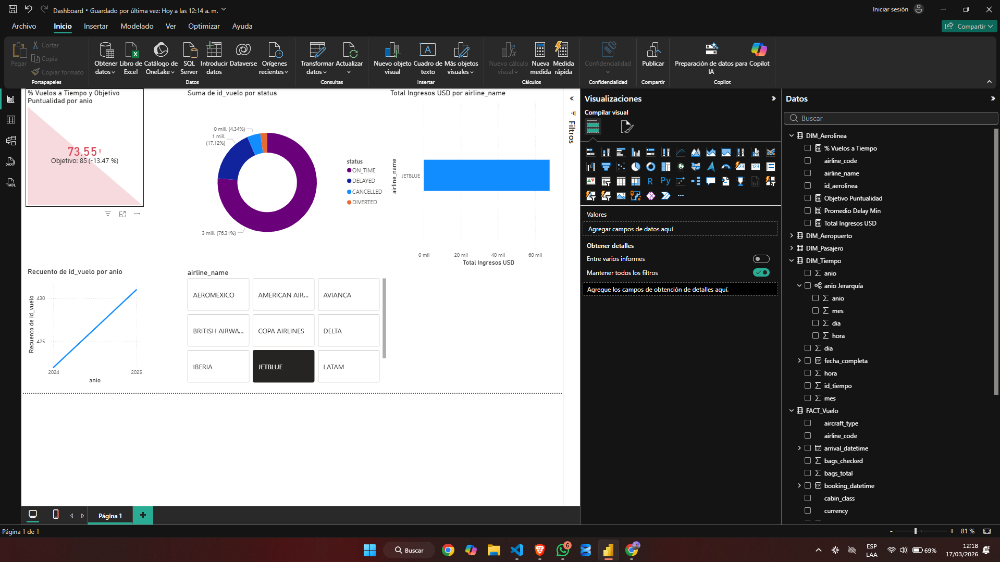
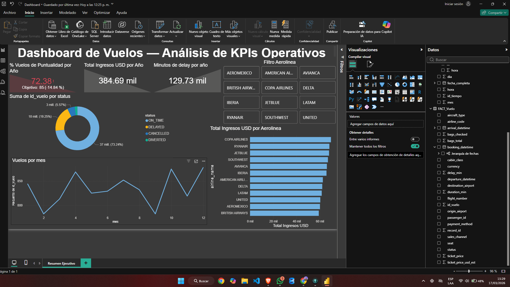

# Práctica 2 — Dashboard y KPIs con Power BI

**Curso:** Seminario de Sistemas 2  
**Universidad:** Universidad San Carlos de Guatemala — Facultad de Ingeniería  
**Estudiante:** Jorge Alejandro De León Batres  
**Carnet:** 202111277  
**Repositorio:** SS22S2026_202111277  

---

## Descripción

Dashboard interactivo construido en Power BI conectado a la base de datos
`vuelos_db` (SQL Server) generada en la Práctica 1. Incluye modelo tabular
con relaciones, jerarquías, medidas DAX y KPIs estratégicos.

---

## Estructura del repositorio
```
SS22S2026_202111277/
└── Practica2/
    ├── Dashboard.pbix
    └──README.md
```

---

## Modelo tabular

### Relaciones

| Tabla FACT | Columna FACT | Dimensión | Columna DIM | Tipo |
|---|---|---|---|---|
| FACT_Vuelo | airline_code | DIM_Aerolinea | airline_code | Activa |
| FACT_Vuelo | passenger_id | DIM_Pasajero | passenger_id | Activa |
| FACT_Vuelo | departure_datetime | DIM_Tiempo | fecha_completa | Activa |
| FACT_Vuelo | origin_airport | DIM_Aeropuerto | codigo_iata | Activa |
| FACT_Vuelo | destination_airport | DIM_Aeropuerto | codigo_iata | Inactiva |

### Jerarquía de fechas
`anio → mes → dia → hora`

### Modelado de la base de datos


---

## Medidas DAX

### Medida 1 — Total de ingresos
```dax
Total Ingresos USD = SUM(FACT_Vuelo[ticket_price_usd_est])
```


### Medida 2 — % vuelos a tiempo
```dax
% Vuelos a Tiempo = 
DIVIDE(
    COUNTROWS(FILTER(FACT_Vuelo, FACT_Vuelo[status] = "ON_TIME")),
    COUNTROWS(FACT_Vuelo),
    0
) * 100
```


### Medida 3 — Promedio de delay
```dax
Promedio Delay Min = 
AVERAGEX(
    FILTER(FACT_Vuelo, FACT_Vuelo[status] = "DELAYED"),
    FACT_Vuelo[delay_min]
)
```


---

## KPI — Puntualidad de vuelos

| Medida | Valor |
|---|---|
| % Vuelos a Tiempo | 72.38% |
| Objetivo | 85% |
| Desviación | -14.84% |

**Interpretación:** El semáforo rojo indica que las aerolíneas no alcanzan
el objetivo de puntualidad del 85%. Esto representa un área crítica de
mejora operativa que impacta directamente la satisfacción del pasajero
y los costos de operación.



---

## Dashboard

El dashboard incluye 4 visualizaciones interactivas conectadas a un
segmentador por aerolínea. Al seleccionar cualquier aerolínea, todos
los visuales se actualizan en tiempo real.

### Visualizaciones implementadas

| Visual | Tipo | Datos |
|---|---|---|
| KPI Puntualidad | KPI con semáforo | % vuelos a tiempo vs objetivo 85% |
| Vuelos por status | Anillo | Distribución ON_TIME / DELAYED / CANCELLED / DIVERTED |
| Ingresos por aerolínea | Barras | Total Ingresos USD por aerolínea |
| Vuelos por año | Línea | Recuento de vuelos 2024-2025 |

### Dashboard sin filtros


### Dashboard con filtro por aerolínea



### Página 1 - Resumen Ejecutivo

---

### Página 2 — Análisis detallado


**Hallazgo:** Crecimiento de ingresos 2024→2025: -0.17%  
Iberia lidera en 2025 mientras Copa Airlines dominó en 2024.

---
## Conclusiones estratégicas

- **Copa Airlines** lidera en ingresos totales USD.
- Solo **72.38%** de vuelos llegan a tiempo — por debajo del estándar
  industrial del 85%.
- El promedio de delay en vuelos retrasados supera los 60 minutos,
  lo que representa un impacto operativo significativo.
- El segmentador permite análisis individual por aerolínea para
  identificar cuáles contribuyen más al problema de puntualidad.