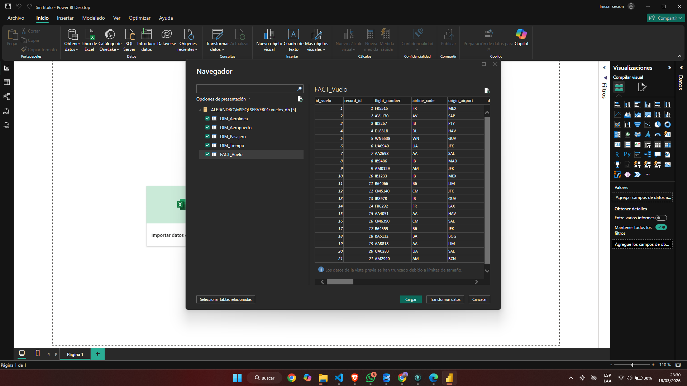

Cargar base de datos 



Modelado de la base de datos


## Medidas DAX

### Medida 1 — Total de ingresos
```dax
Total Ingresos USD = SUM(FACT_Vuelo[ticket_price_usd_est])
```

### Medida 2 — % vuelos a tiempo
```dax
% Vuelos a Tiempo = 
DIVIDE(
    COUNTROWS(FILTER(FACT_Vuelo, FACT_Vuelo[status] = "ON_TIME")),
    COUNTROWS(FACT_Vuelo),
    0
) * 100
```


### Medida 3 — Promedio de delay
```dax
Promedio Delay Min = 
AVERAGEX(
    FILTER(FACT_Vuelo, FACT_Vuelo[status] = "DELAYED"),
    FACT_Vuelo[delay_min]
)
```


## KPI — Puntualidad de vuelos

| Medida | Valor |
|---|---|
| % Vuelos a Tiempo | 72.38% |
| Objetivo | 85% |
| Desviación | -14.84% |

**Interpretación:** La aerolínea no alcanza el objetivo de puntualidad.
El semáforo rojo indica área de mejora operativa.


