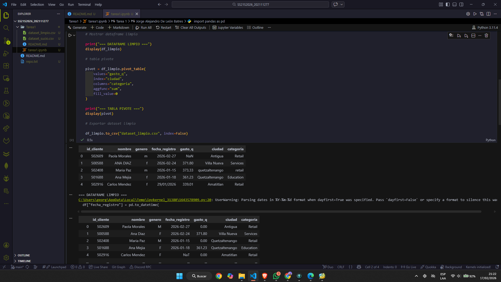
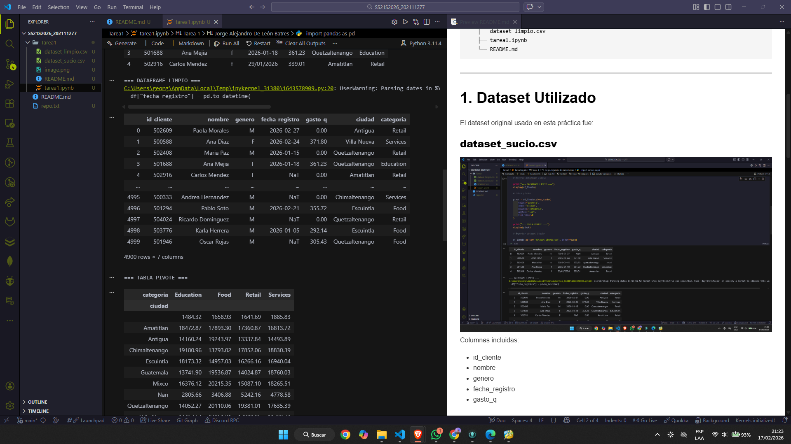
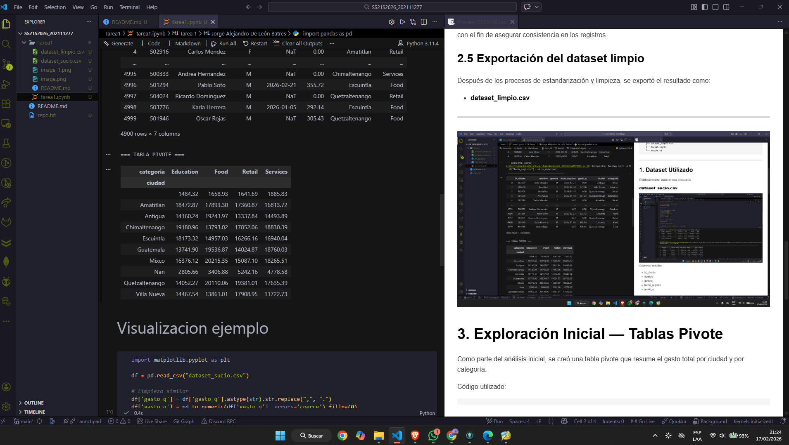
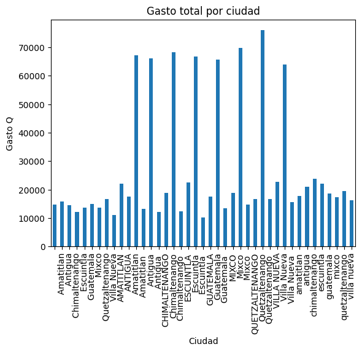

# Tarea 1  
**Seminario de Sistemas 2 – Ingeniería en Ciencias y Sistemas**  
**Universidad de San Carlos de Guatemala**  

**Autor:** Jorge Alejandro De León Batres  
**Carnet:** 202111277  
**Entorno de trabajo:** VS Code  

---

# Título del Proyecto
## Limpieza y análisis inicial de datos con Python y Pandas

Este proyecto corresponde a la **Tarea 1** del curso Seminario de Sistemas 2.  
El objetivo es realizar un proceso completo de **limpieza, estandarización y exploración inicial** de un dataset asignado, aplicando técnicas fundamentales de ingeniería de datos utilizando Python y la librería Pandas.

---

#  Estructura del Repositorio

```
SS2IS2026_202111277/
│
└── Tarea1/
    ├── dataset_sucio.csv
    ├── dataset_limpio.csv
    ├── tarea1.ipynb
    └── README.md
```

---

#  1. Dataset Utilizado

El dataset original usado en esta práctica fue:

### **dataset_sucio.csv**

Columnas incluidas:

- id_cliente  
- nombre  
- genero  
- fecha_registro  
- gasto_q  
- ciudad  
- categoria  

Problemas detectados en el dataset original:

- Fechas escritas en múltiples formatos  
- Montos con coma decimal  
- Presencia de valores vacíos  
- Categorías escritas en distintas capitalizaciones (Retail, RETAIL, retail)  
- Espacios innecesarios en texto  
- Datos textuales inconsistentes  
- Potenciales duplicados  

---

#  2. Proceso de Limpieza Aplicado

Toda la limpieza se realizó en el archivo **tarea1.ipynb**, utilizando Pandas.

## 2.1 Normalización y limpieza de texto
- Se aplicó `.str.strip()` para eliminar espacios adicionales.  
- Se aplicó `.str.title()` para unificar criterios (ej. `retail` → `Retail`).  
- Los nombres y ciudades fueron estandarizados.

## 2.2 Limpieza del campo monetario `gasto_q`
Transformaciones realizadas:
1. Reemplazo de coma decimal por punto.  
2. Conversión del campo a tipo numérico (`float`).  
3. Imputación de valores faltantes con `0`.  

Ejemplo de código usado:

```python
df["gasto_q"] = (
    df["gasto_q"].astype(str).str.replace(",", ".")
)
df["gasto_q"] = pd.to_numeric(df["gasto_q"], errors="coerce").fillna(0)
```

## 2.3 Conversión y estandarización de fechas

La columna poseía formatos mixtos como:
- `2026-02-27`
- `29/01/2026`
- `08/01/2026`

Se unificó usando:

```python
df["fecha_registro"] = pd.to_datetime(df["fecha_registro"], dayfirst=True, errors="coerce")
```

## 2.4 Eliminación de duplicados
Se utilizó la función:

```python
df.drop_duplicates()
```

con el fin de asegurar consistencia en los registros.

## 2.5 Exportación del dataset limpio

Después de los procesos de estandarización y limpieza, se exportó el resultado como:

- **dataset_limpio.csv**

---



# 3. Exploración Inicial — Tablas Pivote

Como parte del análisis inicial, se creó una tabla pivote que resume el gasto total por ciudad y por categoría.

Código utilizado:

```python
pivot = df_limpio.pivot_table(
    values="gasto_q",
    index="ciudad",
    columns="categoria",
    aggfunc="sum",
    fill_value=0
)
```

Esto permitió analizar:
- Distribución del gasto total por ciudad  
- Qué categorías presentan mayor actividad económica  
- Comparación entre regiones  

---

# 4. Capturas Incluidas

El repositorio contiene capturas donde se muestra:

1. **Dataset original** antes de la limpieza  

2. **Dataset limpio** posterior a las transformaciones  

3. **Visualización del gasto total por ciudad**  

Estas evidencias permiten validar el proceso completo.

---

# 5. Archivos Entregados

| Archivo | Descripción |
|---------|-------------|
| dataset_sucio.csv | Dataset original antes de la limpieza |
| dataset_limpio.csv | Dataset completamente depurado |
| tarea1.ipynb | Notebook con todo el proceso y visualizaciones |
| README.md | Documentación completa del proyecto |

---

# 6. Interpretación Técnica del Análisis

- La normalización de texto eliminó inconsistencias derivadas de diferencias en mayúsculas/minúsculas.  
- La conversión estandarizada de fechas habilitó el análisis temporal del dataset.  
- La limpieza del campo monetario permitió realizar operaciones matemáticas sin errores.  
- La tabla pivote reveló patrones de consumo por ciudad y por categoría, lo cual habilita análisis posteriores como segmentación y proyecciones.  
- El dataset limpio cumple con principios de calidad de información según la ISO 25012:  
  - Exactitud  
  - Consistencia  
  - Completitud  
  - Validez  
  - Accesibilidad  

---

# 7. Conclusiones

El proceso aplicado permitió transformar un dataset con múltiples inconsistencias en una base de datos coherente, analizable y lista para ser utilizada en procesos de toma de decisiones.  
Este trabajo cumple con los requerimientos de la Tarea 1 y demuestra el uso adecuado de técnicas de preparación y análisis inicial de datos en Python.

---

