# Tarea 2
## Jorge Alejandro De León Batres
## 202111277
Extracción del csv
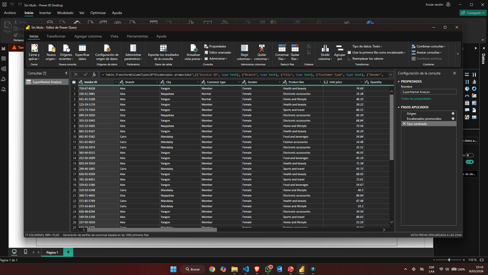

Cambio de tipo de dato en Date, antes era texto y se pasa a tipo date
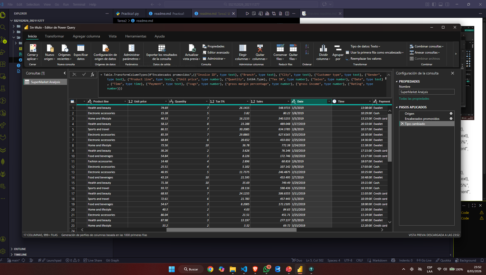

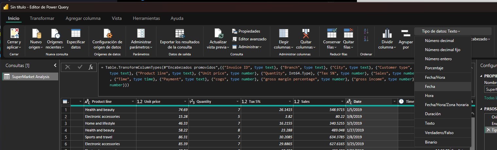
Problema con el tipo de fecha, estaba tomando la fecha como DD/MM/YYYY, y el formato correcto es el MM/DD/YYYY
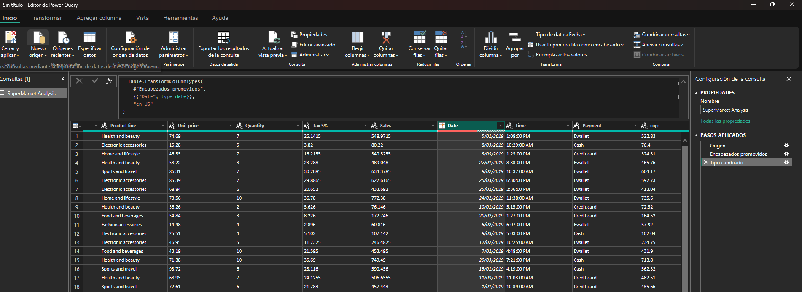

Time con tipo de dato de hora
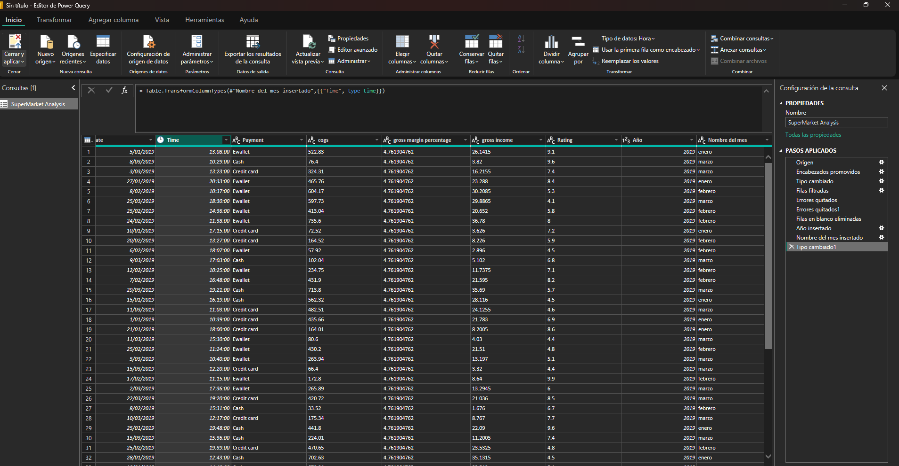

Se quitaron las filas con errores
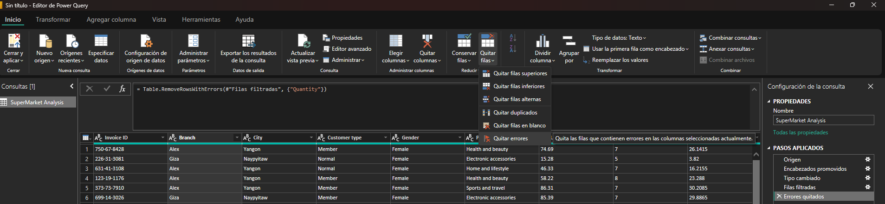
Se quitaron filas con blancos
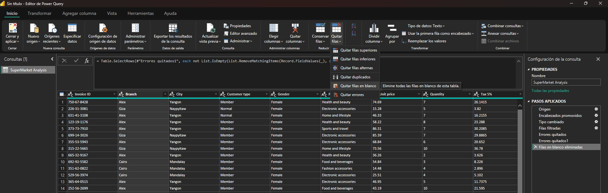

Se agregó la columna Año
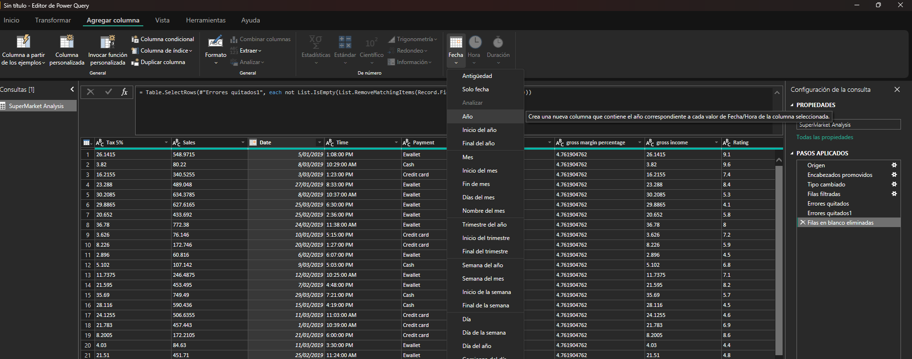
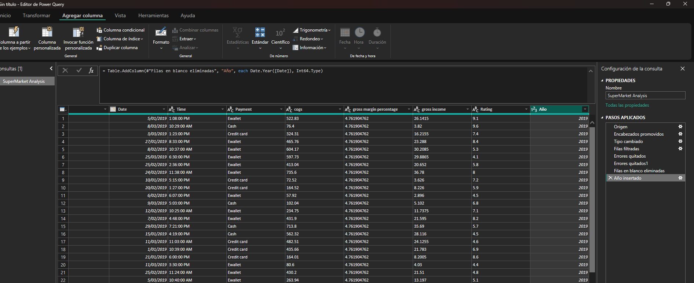

Se agregó la columna Mes
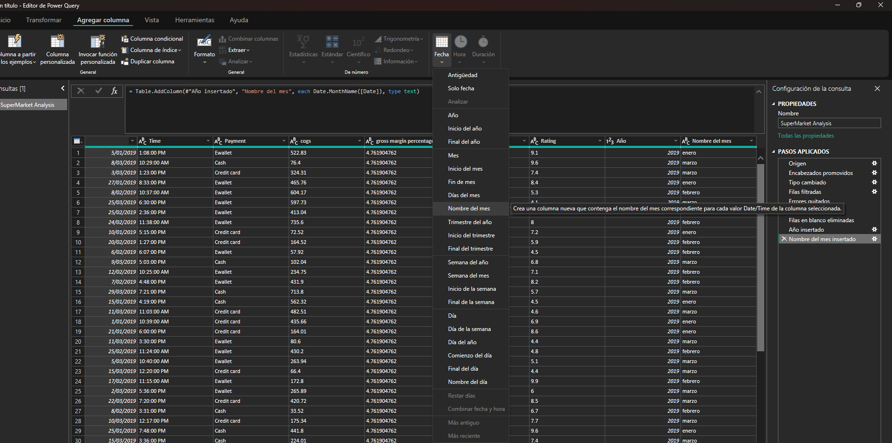

----------------------------------

# Power BI
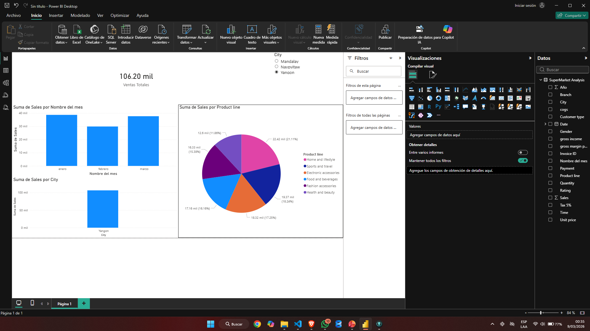